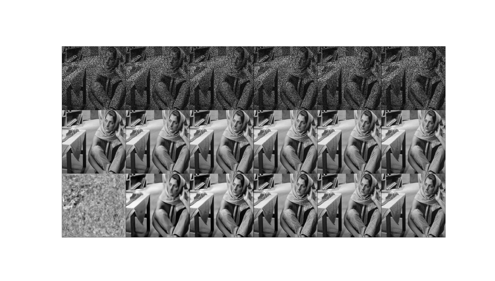

# DIP

#### Title
[Deep Image Prior](https://arxiv.org/abs/1505.04597)

#### Abstract
Deep convolutional networks have become a popular tool for image generation and restoration. Generally, their excellent performance is imputed to their ability to learn realistic image priors from a large number of example images. In this paper, we show that, on the contrary, the structure of a generator network is sufficient to capture a great deal of low-level image statistics prior to any learning. In order to do so, we show that a randomly-initialized neural network can be used as a handcrafted prior with excellent results in standard inverse problems such as denoising, super-resolution, and inpainting. Furthermore, the same prior can be used to invert deep neural representations to diagnose them, and to restore images based on flash-no flash input pairs.
Apart from its diverse applications, our approach highlights the inductive bias captured by standard generator network architectures. It also bridges the gap between two very popular families of image restoration methods: learning-based methods using deep convolutional networks and learning-free methods based on handcrafted image priors such as self-similarity. Code and supplementary material are available at [this https URL](https://dmitryulyanov.github.io/deep_image_prior) .

## Train
    $ python main.py --mode train \
                     --scope [scope name] \
                     --name_data [data name] \
                     --dir_data [data directory] \
                     --dir_log [log directory] \
                     --dir_checkpoint [checkpoint directory]
                     --gpu_ids [gpu id; '-1': no gpu, '0, 1, ..., N-1': gpus]
---
    $ python main.py --mode train \
                     --scope inpainting_hourglass \
                     --name_data restoration1 \
                     --dir_data ./datasets \
                     --dir_log ./log \
                     --dir_checkpoint ./checkpoint
                     --gpu_ids 0

* Set **[scope name]** uniquely.
* To understand hierarchy of directories based on their arguments, see **directories structure** below. 
* Hyperparameters were written to **arg.txt** under the **[log directory]**.
* Generated images are saved in the **images** subfolder along with **[result directory]** folder.
* **index.html** is also generated to display the generated images.  

## Tensorboard
    $ tensorboard --logdir [log directory]/[scope name]/[data name] \
                  --port [(optional) 4 digit port number]
---
    $ tensorboard --logdir ./log/unet/em \
                  --port 6006
                  
After the above comment executes, go **http://localhost:6006**

* You can change **[(optional) 4 digit port number]**.
* Default 4 digit port number is **6006**.

## Results

    1st row: input & target; 50 % missing data
    2nd row: label; clean image (barbara.png)
    3rd row: output; restorated image
    
    From 1st to 6th columns: 1st, 500th, 1000th, 3000th, 10000th, 20000th outputs

* The results were generated by a network trained with **barbara.png** during **20,000 epochs**.
* After running the Test phase, execute **display_result.py** to display the figure.
